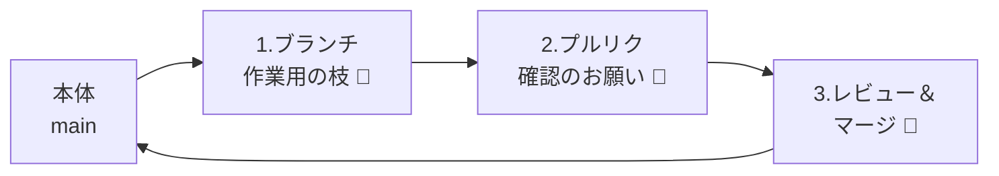
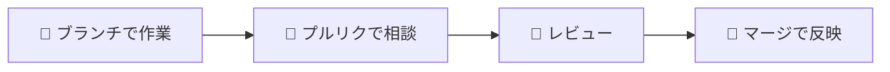

# みんなで使う（プルリク・マージ）

!!! info "この章のゴール"
    複数人で安全に共同作業する流れ（**ブランチ → プルリクエスト → マージ**）が分かること。

<figure markdown="span">
  { width="320" }
  <figcaption>いきなり本体を変えず、「相談してから反映」が基本</figcaption>
</figure>

全体の流れはこうです。



!!! tip "おすすめの進め方"
    いきなり本体を変えず、「**ブランチで作業 → プルリクで相談 → マージ**」の流れを習慣にすると安全です。

---

## 1. ブランチを作る

**ブランチ**は「作業用の分かれ道」です（→ [用語集](glossary.md)）。
本体（みんなが使う版＝`main`）に影響を与えずに、別の場所で安心して作業できます。

=== ":material-robot-happy-outline: Claudeに頼む"

    ```text
    「fix-typo」という名前のブランチを作って、そっちに切り替えて。
    ```

    どんなブランチ名がいいかも相談できます（例：`add-photos`、`update-readme`）。

=== ":material-microsoft-visual-studio-code: VSCodeで操作"

    1. VSCode左下の **ブランチ名（例：`main`）** をクリック
    2. **＋ 新しいブランチの作成** を選ぶ
    3. ブランチ名を入れる（例：`fix-typo`）
    4. そのブランチに切り替わる

=== ":material-console: CLIで操作"

    ```bash
    # fix-typo ブランチを作って、そのブランチに切り替える
    git switch -c fix-typo
    ```

    !!! note
        いまどのブランチにいるかは `git branch` で確認できます（`*` が付いているのが現在地）。

=== ":material-web: GitHubサイトで操作"

    1. リポジトリ画面の左上、**ブランチ切り替えのボタン**（`main ▾`）を押す
    2. 入力欄に新しい名前（例：`fix-typo`）を入れる
    3. **Create branch: fix-typo** を押す

!!! note "ブランチ名のつけ方"
    「何をするか」が分かる名前にします。例：`fix-typo`（誤字直し）、`add-photos`（写真追加）。

---

## 2. 変更してプルリクエストを出す

ブランチで変更・コミット・プッシュしたら（→ [コミットの章](commit-push.md)）、
**プルリクエスト（PR）** で「この変更を本体に入れていいですか？」と相談します。

=== ":material-robot-happy-outline: Claudeに頼む"

    ```text
    いまのブランチの変更で、プルリクエストを作って。
    タイトルと説明も、変更内容に合わせて書いて。
    ```

    !!! note "Claudeも内部で `gh` を使います"
        プルリク作成には `gh`（GitHub CLI）が使われます。未導入なら Claudeに **「`gh` を入れて」** と頼むか、[GitとGitHubをつなぐ（GitHub CLI）](setup-git.md#github-cli-gh) を参照してください。

=== ":material-microsoft-visual-studio-code: VSCodeで操作"

    VSCodeの拡張機能 **「GitHub Pull Requests」** を入れると、VSCodeからPRを作れます。

    1. 拡張機能で **`GitHub Pull Requests`** を検索してインストール
    2. 左側に増える **PRアイコン** から **Create Pull Request** を押す
    3. タイトル・説明を書いて **Create** を押す

=== ":material-console: CLIで操作"

    ```bash
    # いまのブランチの内容でプルリクを作成（タイトル等は対話で入力／--fillで自動）
    gh pr create --fill
    ```

    !!! note "`gh`（GitHub CLI）の準備"
        このタブには **GitHub CLI（`gh`）** が必要です（入れ方は [GitとGitHubをつなぐ（GitHub CLI）](setup-git.md#github-cli-gh)）。
        作成後、URLが表示されるのでブラウザで確認できます。

=== ":material-web: GitHubサイトで操作"

    1. リポジトリの画面を開くと **Compare & pull request** ボタンが出る → 押す
    2. **タイトル** と **説明**（何を・なぜ変えたか）を書く
    3. **Create pull request** を押す
    4. 確認してほしい人がいれば **Reviewers** で指定する

    !!! quote "📷 画面キャプチャ枠（あとで差し込み）"
        プルリクエスト作成画面を入れます。
        `{ width="700" }`

---

## 3. レビューしてマージする

ほかの人に見てもらい（**レビュー**）、OKなら本体に合流（**マージ**）します。

<figure markdown="span">
  { width="300" }
  <figcaption>「これでOK」となったら本体に取り込む</figcaption>
</figure>

基本の流れ（レビューする側 → マージする側）：

1. **レビュー**：変更点（Files changed）を確認し、気づきはコメント、問題なければ **Approve（承認）**
2. **マージ**：承認されたら本体に合流させ、使い終わったブランチは片付ける

=== ":material-robot-happy-outline: Claudeに頼む"

    ```text
    このプルリクをレビューして、問題がなければマージして。
    使い終わったブランチも消して。
    ```

=== ":material-microsoft-visual-studio-code: VSCodeで操作"

    「GitHub Pull Requests」拡張のPR一覧から対象を開き、
    画面内の **Approve（承認）** や **Merge Pull Request** のボタンで操作できます。

=== ":material-console: CLIで操作"

    ```bash
    gh pr checks      # 確認（任意）
    gh pr merge       # マージ（やり方を対話で選択。--merge 等でも指定可）
    ```

=== ":material-web: GitHubサイトで操作"

    1. プルリクの **Files changed** で変更点を確認
    2. 問題なければ **Review changes → Approve**
    3. **Merge pull request → Confirm merge** で本体に反映
    4. 使い終わったブランチは **Delete branch** で片付ける

!!! warning "マージの前に"
    マージは「本体に反映する」操作です。**内容を確認してから** 行いましょう。
    不安なときは、詳しい人やClaudeに「この変更、マージして大丈夫？」と聞くと安心です。

---

## この章のまとめ



- [x] ブランチで安全に作業できる
- [x] プルリクで相談できる
- [x] レビューしてマージできる

!!! success "次のステップ"
    共同作業の流れがつかめました。次は、ここまでの流れを **通しで練習** してみましょう。

    👉 [練習：通しでやってみる](practice.md)
