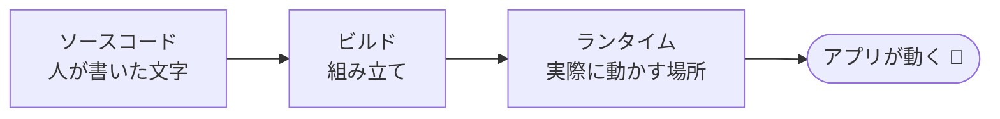
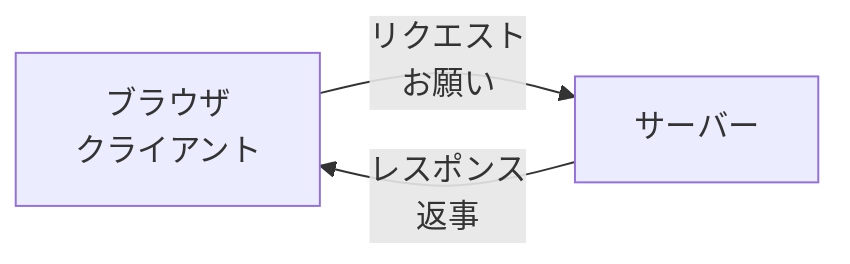
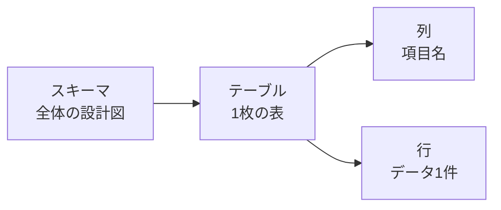
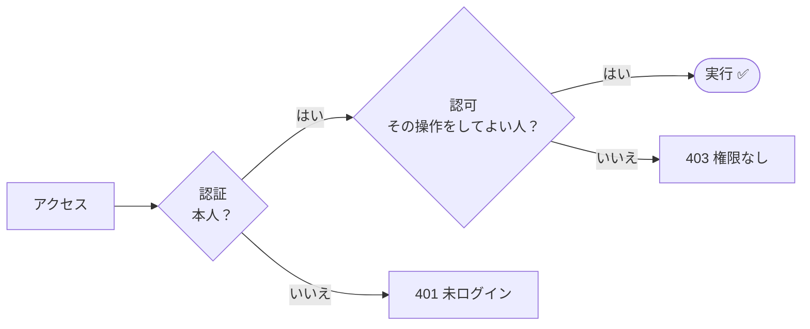
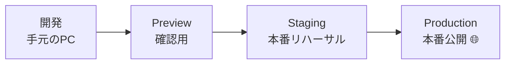

# 開発の技術用語集

!!! info "このページのねらい"
    Claudeと一緒に開発を進めていると、**説明の中に出てくる言葉が分からなくて止まる** ことがあります。
    ここでは「AIの説明を読むとき」「AIに指示するとき」に出てくる言葉を、**1行の意味＋たとえ** で並べました。

!!! tip "覚えなくて大丈夫。引くためのページです"
    上から順に読む必要はありません。**知らない言葉が出てきたときに戻ってきて引く** のがおすすめです。
    ページ内検索（Windows: `Ctrl + F` ／ Mac: `⌘ + F`）か、右上の 🔍 が便利です。

!!! note "ほかの用語集との使い分け"
    - パソコン全般の言葉（ファイル・パス・ターミナル・コマンドなど）→ [基本のIT用語集](it-basics.md)
    - Git/GitHub特有の言葉（コミット・ブランチ・プルリクなど）→ [GitHubの用語集](glossary.md)
    - AI・Claudeの言葉（プロンプト・トークン・MCPなど）→ [Claudeの用語集](claude-terms.md)

---

## :material-toolbox-outline: 0. まず押さえる（開発の土台）

### :material-open-source-initiative: OSS ／ オープンソース（Open Source）
**プログラムの中身（ソースコード）が公開され、誰でも見たり使ったりできるもの** です。多くの開発ツールがこれ。

> 🌍 たとえ：レシピを無料公開して、みんなで改良していくイメージ。

### :material-package-variant-closed: パッケージ ／ ライブラリ（Package / Library）
**他の人が作った「便利な部品（プログラム）」** です。これを組み合わせて開発を速くします。

> 🧱 たとえ：自作せず使える「既製のブロック」。

!!! warning "AIは気軽に部品を増やす"
    AIは機能を実現するために、**新しいライブラリを次々に足しがち** です。中には更新が止まったものや、
    **実在しない架空の名前** を提案してくることもあります。見慣れない部品名が出てきたら、
    「**それは何のために必要で、今もメンテナンスされていますか？**」と聞き返しましょう。

### :material-package-variant: パッケージマネージャー（Package Manager）
**パッケージ（部品）の入手・更新・管理をしてくれる道具** です。例：`npm`・`pnpm`。

> 📦 たとえ：必要な部品を取り寄せて在庫管理してくれる「資材係」。

### :material-view-dashboard-variant-outline: フレームワーク（Framework）
**アプリ作りの「土台・骨組み」** です。よくある仕組みが用意され、ゼロから作らずに済みます。

> 🏗️ たとえ：ライブラリが「後から買い足す家具」、フレームワークが「間取りや配管が決まった賃貸物件」。1つのアプリに1つ選びます。

---

## :material-file-code-outline: 1. プログラムが動くまで

### :material-code-tags: ソースコード ／ プログラミング言語
**人が読み書きできる形で書かれた「命令文」** がソースコードです。その書き方のルールが **プログラミング言語**（Python・TypeScript など）。

> 📜 たとえ：ソースコードが「楽譜」、プログラミング言語は「楽譜の記法」。

### :material-play-box-outline: ランタイム（Runtime／実行環境）
**書かれたコードを実際に動かす側のソフト** です。ブラウザや Node.js などが代表例。

> 🎻 たとえ：楽譜（コード）を実際に鳴らす「演奏者」。演奏者が違えば、同じ楽譜でも鳴らないことがある。

!!! warning "「自分のPCでは動いたのに」の正体"
    手元では動くのにサーバーで動かない、というトラブルは、コードのミスではなく
    **ランタイムのバージョン違い** が原因のことがよくあります。

### :material-hammer-wrench: ビルド（Build）／ コンパイル ／ トランスパイル ／ バンドル
**ビルド** は、書いたコードを **実際に動く形にまとめ上げる** 工程全体のこと。その中身は主に3つです。

| 工程 | やっていること | たとえ |
|---|---|---|
| **トランスパイル** | 書き方Aの言語 → 書き方Bの言語に翻訳 | 関西弁を標準語に言い換える |
| **コンパイル** | 人が読む言語 → 機械が読む形に変換 | 日本語をモールス信号に変える |
| **バンドル** | バラバラのファイルを1つにまとめる | 細かい荷物を1箱に詰める |

> 🏭 たとえ：部品を組み立てて製品にする「工場のライン」。

!!! danger "公開前に必ず1回ビルドを通す"
    開発中の画面（`npm run dev`）は、多少の不整合を **見逃したまま表示** します。
    一方、公開用のビルドは1か所でもおかしいと **止まります**。
    「手元で動いたから公開して」とAIに頼む前に、**手元で一度ビルドを通してもらう** のが失敗を防ぐコツです。

### :material-view-grid-outline: コンポーネント ／ 状態（State）
- **コンポーネント** … 画面を組み立てる **部品**（ヘッダー、ボタン、商品カードなど）。
- **状態（State）** … その部品が持っている **今の状況のデータ**（カートの中身、メニューが開いているか）。

> 🧩 たとえ：コンポーネントが「部品」、状態が「そのスイッチが今オンかオフか」。

!!! note "画面のバグの多くはここ"
    「ボタンを押したのに表示が変わらない」の原因は、たいてい **状態の更新の仕方** です。
    AIに直してもらうときは「**どこを操作したら、どの表示が変わらなかったか**」を日本語で伝えると、特定が速くなります。

### :material-sign-direction: ルート ／ ルーティング（Route / Routing）
**「このURLを開いたら、この画面を出す」という対応づけ** です。

> 🚦 たとえ：住所（URL）を見て、どの部屋に案内するかを決める「交通整理」。

!!! warning "ビルドでは気づけないミス"
    URLの綴りミスは **エラーにならず**、公開してから「404（ページが見つかりません）」で発覚します。
    新しい画面を追加したら、**URLの一覧を書き出してもらって、実際に開いて確認** しましょう。

---

## :material-swap-horizontal: 2. やりとりする（通信）

### :material-page-layout-sidebar-left: フロントエンド ／ バックエンド
- **フロントエンド** … 画面・見た目など、利用者が触れる部分。
- **バックエンド** … 裏側の処理・データ管理など、見えない部分。

> 🎭 たとえ：お店の「客席・接客（フロント）」と「厨房・倉庫（バック）」。

!!! danger "画面側に秘密を置いてはいけない"
    フロントエンド（ブラウザ側）に渡したものは、**利用者が中身を覗ける** と考えてください。
    データベースのパスワードや秘密のカギを画面側のコードに書くと、そのまま見られてしまいます。
    変更を頼むときは「**この処理はどちら側で動きますか？**」と確認する習慣をつけると安全です。

### :material-server-network: サーバー ／ クライアント（Server / Client）
- **サーバー** … サービスやデータを **提供する側**（ネットの向こう側）。
- **クライアント** … それを **受け取って使う側**（手元のPC・ブラウザ）。

> 🍽️ たとえ：料理を出す「お店（サーバー）」と、注文して食べる「お客（クライアント）」。

### :material-lan-connect: localhost（ローカルホスト） ／ ポート（Port）
- **localhost** … **自分のPC自身** を指す住所。作りかけのアプリを手元で確認するときに使う。
- **ポート** … 1台のPCの中の **出入口の番号**。例：`localhost:3000`。

> 🚪 たとえ：自分の家（localhost）の、どのドアか（ポート番号）。

!!! note "よく出るエラー：ポートが使用中"
    アプリを終了せずにもう一度起動すると「**Port already in use**」と出ます。
    Claudeに「**3000番を使っているプログラムを止めて**」と頼めば解消できます。
    また、`localhost` のURLは **自分のPCの中だけの住所** なので、他の人に送っても開けません。

### :material-transit-connection-variant: HTTP ／ HTTPS
**Webでデータをやり取りするときの「通信のお約束」** です。**HTTPSは通信が暗号化** されて安全。

> 🔒 たとえ：HTTP＝はがき、HTTPS＝封筒に入れた手紙。

### :material-message-arrow-right-outline: HTTPリクエスト ／ レスポンス
- **リクエスト** … ブラウザからサーバーへの **お願い**。
- **レスポンス** … サーバーからの **返事**。

Web上の操作（ログイン・検索・購入）は、すべてこの往復でできています。**話しかけるのは必ずブラウザ側から** で、サーバーから勝手に話しかけることはできません。

> 📮 たとえ：手紙を出して（リクエスト）、返信をもらう（レスポンス）。

### :material-numeric: HTTPメソッド ／ ステータスコード
- **メソッド** … 「何をしてほしいか」の動詞。
- **ステータスコード** … 「結果はどうだったか」の3桁の番号。

| メソッド | 意味 |
|---|---|
| **GET** | 見る・取ってくる |
| **POST** | 新しく登録する |
| **PUT / PATCH** | 書き換える |
| **DELETE** | 消す |

| 番号 | 意味 | よく見る例 |
|---|---|---|
| **200番台** | 成功 ✅ | 200（OK） |
| **300番台** | 引っ越し・転送 | 301（移転しました） |
| **400番台** | **頼んだ側**の問題 | 401（未ログイン）／403（権限なし）／404（存在しない） |
| **500番台** | **サーバー側**の問題 💥 | 500（内部エラー） |

!!! tip "エラーの切り分けに効く"
    404なら「URLが違う」、401/403なら「ログインか権限」、500なら「サーバーの中で落ちている」。
    **番号を伝えるだけで、Claudeの調査精度がぐっと上がります。**

### :material-api: API ／ エンドポイント ／ REST API ／ SDK
- **API** … プログラム同士が情報をやり取りするための **窓口・取り決め**。
- **エンドポイント** … その窓口の **具体的な住所（URL）**。
- **REST API** … 窓口の作り方の **もっとも標準的なルール**。
- **SDK** … その窓口を **らくに使えるようにした道具セット**。

> 🏪 たとえ：API が「注文カウンター」、エンドポイントが「その場所」、SDK が「注文を代行してくれる店員」。

!!! note "外部サービス連携でつまずいたら"
    AIは学習した時点の **古い書き方** を出してくることがあります。うまく動かないときは、
    「**使っているSDKのバージョンは、最新の仕様に合っていますか？**」と確認してもらいましょう。

### :material-code-json: JSON（ジェイソン）
**データを整理して書くための「決まった書き方」** です。設定やデータのやり取りでよく使われます。

> 🧾 たとえ：項目名と中身をきれいに並べた「記入フォーマット」。

!!! warning "1文字のミスで全部止まる"
    JSONは書き方がとても厳格で、**カンマ1つ多い・引用符の付け忘れ** だけで読み込みが失敗します。
    AIが返した内容をそのまま扱うときは、**失敗しても止まらないようにする処理** を入れてもらうと安心です。

### :material-bell-ring-outline: Webhook（ウェブフック）
**相手のサービス側で何かが起きた瞬間に、向こうから通知を送ってきてくれる仕組み** です。

> 📞 たとえ：普通のAPIは「できましたか？」と自分から何度も聞きに行く。Webhookは「できました」と向こうから電話がかかってくる。

!!! danger "通知の受け口は世界中に開いている"
    Webhookの受け口は誰でもアクセスできる状態になるため、**偽の通知を送りつけられる** リスクがあります。
    「**本物からの通知か確かめる処理（署名検証）**」と「**同じ通知が2回届いても二重処理しない仕組み**」の2つを、必ず入れてもらってください。

### :material-transfer-down: ストリーミング ／ SSE ／ WebSocket
- **ストリーミング** … 全部できあがるのを待たず、**できた分から順に流して表示** する方式。
- **SSE** … サーバー → ブラウザへ **一方通行** で流す、軽い仕組み。
- **WebSocket** … 回線をつなぎっぱなしにして **双方向** にやりとりする仕組み。

> 🍣 たとえ：全品そろってから運ぶのではなく、できた皿から出す方式。

!!! note "速くなるのは「待ち時間の体感」"
    ストリーミングにしても、**処理そのものが短くなるわけではありません**。
    改善されるのは「最初の1文字が出るまでの待ち時間」です。

### :material-shield-alert-outline: CORS（コルス） ／ オリジン（Origin）
- **オリジン** … 「http/https」「ドメイン」「ポート番号」の3点セットで決まる **住所の単位**。1つでも違えば別の住所扱い。
- **CORS** … ブラウザが持つ **「よその住所のデータを勝手に読ませない」防犯機能** と、その許可設定。

> 🚧 たとえ：勝手に他人の家の郵便物を読めないようにする決まり。読ませたい相手だけ、名指しで許可する。

!!! danger "「`*`（全部許可）で解決」は危険"
    CORSエラーが出ると、**すべてのサイトからのアクセスを許可する（`*`）** という直し方で一瞬で消せてしまいます。
    ただしそれは **防犯機能を全部外す** のと同じです。Claudeに頼むときは
    「`*` は使わず、**開発用のURLと本番のURLだけ** を名指しで許可して」と伝えましょう。

---

## :material-database-outline: 3. データを保管する

### :material-database: データベース（DB） ／ SQL（エス・キュー・エル）
- **データベース** … データを整理して保存・検索できる「倉庫」。
- **SQL** … そのデータベースに **問い合わせるための言葉**。

> 🗄️ たとえ：棚分けされた倉庫（DB）と、「○○を出して」と頼む伝票（SQL）。

!!! warning "Gitでは元に戻せない場所"
    コードは [Git](glossary.md) で過去に戻せますが、**データベースの中身は Git の管理対象外** です。
    本番のデータを触る変更をAIに頼むときは、特に慎重に確認してください。

### :material-table: テーブル ／ 行 ／ 列 ／ スキーマ
Excelの表をイメージすると、ほぼそのままです。

| 言葉 | Excelでいうと |
|---|---|
| **テーブル** | 1枚のシート（例：顧客一覧） |
| **列（カラム）** | 縦の項目名（会社名・メール・契約日） |
| **行（レコード）** | 横1行分のデータ（顧客1社ぶん） |
| **スキーマ** | どんなシートがあり、どんな項目を持つかの **設計図全体** |

!!! warning "Excelと決定的に違うところ"
    Excelなら列を後から足して、既存の行を空欄のまま置いても平気です。
    データベースでは **「必ず入力」ルールの列を後から足すと、既存のデータが全部ルール違反になって止まる** ことがあります。
    列を追加してもらうときは「**既存データには何を入れるか**」まで一緒に決めてもらいましょう。

### :material-magnify: クエリ ／ CRUD（クラッド）
- **クエリ** … データベースへの **1回分の命令**。
- **CRUD** … データ操作の基本4つの頭文字。

| | 操作 | 危険度 |
|---|---|---|
| **C** reate | 登録する | 低（消せば戻せる） |
| **R** ead | 読む | 低（何も変わらない） |
| **U** pdate | 書き換える | **高**（前の値が消える） |
| **D** elete | 消す | **高**（戻せない） |

!!! danger "UとDは一発で取り返しがつかない"
    条件の指定を1文字書き間違えただけで、**全データを書き換える／全部消す** ことがあります。
    更新・削除をAIに頼むときは「**先に同じ条件で「何件が対象か」を数えて報告してから実行して**」と一言添えてください。

### :material-key-link: 主キー ／ 外部キー ／ リレーション
- **主キー** … その1件を確実に見分ける **背番号**（重複なし・空欄なし）。
- **外部キー** … 別の表を **指し示す項目**（例：この注文は顧客ID 5番のもの）。
- **リレーション** … 主キーと外部キーで結ばれた **表どうしのつながり**。

> 🔗 たとえ：社員番号（主キー）で人を特定し、「担当者＝社員番号5番」と書いて紐づける（外部キー）。

!!! note "名前をそれっぽくしただけでは繋がらない"
    列名を `user_id` にしても、それだけでは「ただの数字の列」です。
    **存在しない相手を指すデータをブロックしてもらう** には、外部キーの制約を明示的に設定する必要があります。

### :material-database-sync-outline: マイグレーション（Migration）
**データベースの構造の変更を、履歴のあるファイルとして記録・適用していく仕組み** です。

> 🧾 たとえ：間取り変更の記録を1枚ずつ残しておき、同じ順で当てれば、どの部屋も同じ間取りに揃う。

!!! danger "「リセットして作り直す」は本番では致命傷"
    構造がこんがらがったとき、**データベースを初期化して当て直す** のは手元では有効です。
    しかし **公開中の本番で実行すると、これまでのユーザー登録も売上も全部消えます**（構造は戻ってもデータは戻りません）。
    リセットを提案されたら「**それはどの接続先に適用されますか？ 本番ではないですね？**」と必ず確認を。

### :material-translate: ORM（オー・アール・エム）
**SQLを直接書かなくても、普段のプログラミング言語の書き方のままデータベースを操作できる道具** です。

> 🗣️ たとえ：外国語（SQL）を話さずに済ませてくれる「自動通訳」。

!!! note "便利さの裏で通信が増えていることがある"
    書き方が簡単になるぶん、**裏で何十回も倉庫に問い合わせが飛んでいる** ことに気づけません。
    表示が遅いときは「**まとめて取得する形に最適化できませんか？**」と聞いてみてください。

### :material-folder-multiple-image: オブジェクトストレージ
**画像・動画・PDFなど、大きなファイルを置くための専用の倉庫** です。

> 🏬 たとえ：大きな荷物は倉庫に預け、データベースには「預り証（URL）」だけ書いておく2段構え。

!!! danger "既定で「全員が見られる」になりがち"
    請求書PDFや個人の写真を、誰でも見られる置き場に入れてしまうと、
    **URLさえ分かればログインなしで全世界からダウンロードできる** 状態になります。
    見せてよい相手が限られるファイルは、**非公開の置き場＋一定時間だけ有効なURL** を使うようAIに指示してください。

---

## :material-lock-outline: 4. 安全に使う（認証・認可）

### :material-shield-account-outline: 認証（Authentication） ／ 認可（Authorization）
- **認証** … 「**本人かどうか**」を確かめること。
- **認可** … 「**その人がその操作をしてよいか**」を判断すること。

> 🪪 たとえ：ビルの入口で社員証を見せるのが認証。そのうえで「サーバー室に入れるかどうか」が認可。

!!! danger "AIがいちばん抜かすのは「認可」"
    ログイン画面（認証）は頼めばきれいに作ってくれます。
    ところが **URLの番号を他人のものに書き換えてアクセスされたときに弾く処理（認可）は、指示しないと抜けがち** です。
    自分のアカウントでテストしている限り気づけないので、必ず明示的に依頼してください。

    また「管理者以外はボタンを隠す」だけでは不十分です。**画面を触らずに直接APIを呼べば実行できてしまう** ため、サーバー側でも確認が必要です。

### :material-cookie-outline: セッション ／ Cookie ／ トークン ／ JWT
ログインした状態が続く仕組みのセットです。

| 言葉 | 役割 | たとえ |
|---|---|---|
| **セッション** | ログインが続いている状態そのもの | 入館中 |
| **トークン / JWT** | 本人だと証明する暗号の文字列 | 会員証 |
| **Cookie** | ブラウザがその会員証を自動で持ち歩く入れ物 | 財布 |

!!! warning "会員証の置き場所で安全性が変わる"
    トークンをブラウザの一般的な保管場所に置くと、**悪意のあるスクリプトから読み取られる** 危険があります。
    Cookieに入れる場合も、**スクリプトから読めない／暗号化通信のときだけ送る／他サイト経由では送らない** の3つの設定が入っているか、Claudeに確認してもらいましょう。

### :material-login-variant: OAuth（オーオース） ／ SSO
- **OAuth** … 自分のアプリにパスワードを打たずに、**GoogleやGitHubのアカウントでログインできる仕組み**。
- **SSO** … 1組のIDとパスワードで、**社内の複数のシステムにまとめてログインできる仕組み**。

!!! note "ドメインを変えたら設定も変える"
    OAuthは「ログイン後に戻ってくるURL」を事前に登録します。1文字でも違うとエラーになるので、
    **独自ドメインへの変更時は、この登録の更新を忘れずに**。

### :material-account-key-outline: 権限 ／ ロール ／ RBAC ／ RLS
- **ロール（役割）** … 管理者・一般・ゲストといった **立場**。
- **RBAC** … その **役割ごとにできることを決める** やり方。
- **RLS** … データベースの **1行ごとに「見てよい人」を限定する** 強力な仕組み。

> 🔐 たとえ：RBACが「役職で入れる部屋を決める」、RLSが「書類1枚ごとに閲覧者を指定する」。

### :material-cog-box: 環境変数（Environment Variable）
**設定値（特にAPIキーなどの秘密）を、コードの外に置いておく仕組み** です。秘密を直接書かずに済みます。

> 🔐 たとえ：金庫に入れておき、コードからは「金庫の中のアレ」と呼ぶイメージ。

### :material-key-alert: シークレット ／ APIキー ／ トークン
**プログラムが使う「パスワードのような秘密のカギ」** です。外部に出してはいけない情報をまとめて **シークレット** と呼びます。

!!! danger "コードに直接書かない"
    AIは動作確認を急いで **キーをコードに直接書いてしまう** ことがあります。
    そのままGitHubに公開すると、**自動巡回に読み取られて不正利用（高額請求）** につながります。

    - 変更を確認するときは「**秘密情報が直接書かれていないか、`.env` に分けられているか**」をチェック
    - `.env` が [.gitignore](glossary.md) で除外されているかも確認
    - パスワード・APIキーは **AIに渡さない／画面に貼らない**。実在の顧客名・案件名や認証情報も同様です（→ [AIと安全に付き合う](ai-safety.md)）

### :material-form-textbox: 入力検証（バリデーション）
**送られてきたデータがルールを満たしているか確かめる仕組み** です（形式・文字数・必須項目など）。

!!! warning "画面側のチェックだけでは守れない"
    ブラウザ側のチェックは **利用者側で無効にできてしまいます**。
    **サーバー側でも同じチェック** が動いているか確認しましょう。

### :material-bug-check-outline: Web脆弱性（ぜいじゃくせい）
**攻撃に使われてしまう設計上の穴** のことです。代表的な3つ:

| 名前 | ざっくり何が起きるか |
|---|---|
| **SQLインジェクション** | 入力欄に細工され、データベースを勝手に操作される |
| **XSS** | 他人のブラウザで不正なスクリプトを動かされる |
| **CSRF** | ログイン状態を横取りされ、意図しない操作をさせられる |

> 🕳️ たとえ：どれも20年以上前から知られた「定番の落とし穴」。対策方法も確立しています。

---

## :material-clock-fast: 5. 動かし方のくふう

### :material-timer-sand: 同期 ／ 非同期 ／ バックグラウンドジョブ ／ キュー
- **同期** … 終わるまで待つ。その間、画面は固まる。
- **非同期** … 「受け付けました」とすぐ返し、**実作業は裏で進める**。
- **キュー（待ち行列）** … 裏で順番待ちさせる列。
- **バックグラウンドジョブ** … その列に並ぶ、裏で動く作業。

> 🎫 たとえ：受付だけ先に済ませて番号札を渡し、調理は裏で進める方式。

!!! note "速くなるのは「待たされ方」"
    非同期にしても **作業時間そのものは短くなりません**。改善されるのは
    「画面が固まらない」「すぐ次の操作に進める」という体感です。

### :material-calendar-clock: Cron（クロン） ／ 定期実行
**決まった時刻や間隔で、プログラムを自動実行する仕組み** です（例：毎朝9時に集計を送る）。

!!! warning "時刻は世界標準時（UTC）のことが多い"
    クラウド上のサーバーの時計は **日本時間ではない** のが普通です。
    「朝9時」のつもりの設定が **夕方18時に動く** といったズレが起きます。
    時刻を指定するときは「**日本時間の◯時になるように**」と明示しましょう。

---

## :material-test-tube: 6. 品質を守る

### :material-bug-outline: バグ ／ エラー ／ :material-magnify-scan: デバッグ
- **バグ** … プログラムの不具合・間違い。
- **エラー** … 処理がうまくいかず止まったときの知らせ。
- **デバッグ** … 原因を探して直すこと。

> 🐛 たとえ：手順書の書き間違い（バグ）、止まった合図（エラー）、それを直す作業（デバッグ）。慌てずでOK（→ [エラーとの付き合い方](ai-errors.md)）。

!!! note "「エラーが出ない＝バグがない」ではない"
    計算結果が1円ずれているようなバグは、**最後まで正常に終わるほどエラーは出ません**。
    エラー画面が無いときは「**どう操作したら／本来どうなるべきで／実際どうなったか**」を言葉で伝えましょう。

### :material-text-box-search-outline: ログ（Log）
**プログラムが「何をしたか」を記録した履歴** です。不具合の原因を調べるときに見ます。

> 📋 たとえ：作業の「実況メモ・記録」。

### :material-format-list-numbered: スタックトレース
**エラーが起きるまでに、どのファイルのどこを通ったかの経路の記録** です。

> 🧭 たとえ：事故が起きるまでの走行ルートを記録したドライブレコーダー。

!!! success "これをそのまま貼るのがいちばん速い"
    「エラーが出た」とだけ伝えるより、**スタックトレースを省略せずそのまま貼る** ほうが、
    Claudeは原因のファイルと行をピンポイントで特定できます。

### :material-check-all: 単体テスト ／ 結合テスト ／ E2Eテスト
| 種類 | 何を確かめるか | たとえ |
|---|---|---|
| **単体テスト** | 部品ひとつが正しく動くか | ネジ1本の強度検査 |
| **結合テスト** | 部品どうしの連携が正しいか | 組み立てた部分の動作確認 |
| **E2Eテスト** | 利用者の操作を最初から最後まで再現 | 実際に運転して1周してみる |

### :material-backup-restore: リグレッション ／ テストカバレッジ
- **リグレッション（デグレ）** … 新しい修正のせいで、**今まで動いていた別の機能が壊れる** こと。
- **テストカバレッジ** … コード全体のうち、テストで確認できている **割合**。

!!! tip "AI開発でいちばん起きやすい事故"
    AIは頼んでいない箇所まで書き換えることがあるため、リグレッションが起きやすいです。
    変更を頼むときに「**他の既存機能への影響（リグレッション）がないか先に確認して**」と添えるだけで、かなり防げます。

### :material-magnify-scan: 静的解析（せいてきかいせき）
**プログラムを動かさずに、書かれた文字を読んで問題を指摘してくれる仕組み** です。書式を整えるもの、危ない書き方を警告するもの、型の不整合を調べるものなどがあります。

!!! danger "「警告を黙らせる」直し方に注意"
    AIは、根本原因を直す代わりに **「この行のチェックだけ無視する」設定を書き足して** 通してしまうことがあります。
    「**チェックを無効化せず、原因自体を直して**」と伝えましょう。

### :material-autorenew: CI ／ CD
- **CI** … コードを送るたびに、**自動でテストやチェックを走らせる** 仕組み。
- **CD** … その検査を通ったものだけを、**自動で公開まで運ぶ** 仕組み。

> 🏭 たとえ：ベルトコンベアで自動検品（CI）し、合格品だけ出荷（CD）する。

!!! note "「私のPCでは動く」を防いでくれる"
    CIは手元の環境に頼らず、まっさらな場所で検証します。GitHub上で赤いバツが出たら、
    **そのログをそのままClaudeに渡す** のが最短です（→ [GitHub Actions](glossary.md)）。

---

## :material-rocket-launch-outline: 7. 公開と運用

### :material-layers-triple-outline: 環境（開発 / Preview / Staging / 本番）
コードが利用者に届くまでに通る、**独立した「動かす場所」** です。

| 環境 | 役割 |
|---|---|
| **開発（development）** | 自分のPCの中 |
| **Preview** | 変更ごとに自動で作られる、確認用の使い捨てURL |
| **Staging** | 本番と同じ条件で行う最終リハーサル |
| **本番（Production）** | 実際の利用者が使う場所 |

!!! danger "テスト環境が本番のデータを触っていないか"
    各環境の **接続先（データベース・決済のキー）が本番のまま** だと、
    テストのつもりの操作で **本物のデータが書き換わる／本物の請求が発生** します。

### :material-server: ホスティング ／ サーバーレス
- **ホスティング** … アプリを置いて動かす **場所を借りるサービス**。
- **サーバーレス** … サーバーが無いという意味ではなく、**管理をすべて任せられる方式**。使った分だけ課金。

!!! note "サーバーレスのクセ"
    しばらくアクセスが無いあとの1回目だけ、起動に数秒かかること（コールドスタート）があります。
    また **1回の処理時間に上限** があるため、重い処理では注意が必要です。

### :material-web: ドメイン ／ DNS ／ HTTPS
- **ドメイン** … `example.com` のような、人が読める住所。
- **DNS** … その名前を、機械用の番号（IPアドレス）に翻訳する **電話帳**。
- **HTTPS** … 通信を暗号化し、接続先が本物だと証明する仕組み（ブラウザの鍵マーク 🔒）。

!!! warning "ドメイン変更は「外部連携」が総崩れになりやすい"
    コードは無事でも、**ログイン後の戻り先・通知の宛先・CORSの許可リスト** などが古いドメインのままだと動かなくなります。
    変更するときは「**ドメイン設定に依存している箇所を全部洗い出して**」と頼みましょう。

### :material-rocket-launch: デプロイ ／ リリース ／ ロールバック
- **デプロイ** … 組み上がったプログラムを **公開先のサーバーに置く** 作業。
- **リリース** … それを **実際に利用者が使える状態にする** こと。
- **ロールバック** … 不具合が見つかったとき、**1つ前の正常な状態に巻き戻す** こと。

> 🚀 たとえ：できた製品をお店に運び（デプロイ）、棚に並べて売り出す（リリース）。問題があれば棚から下げて前の版に戻す（ロールバック）。

!!! success "公開前に戻し方を確認しておく"
    多くのサービスには、ボタン1つで前のバージョンに戻す機能があります。
    **万一のときの手順を、公開前に聞いておく** と安心です。

### :material-cube-outline: コンテナ ／ Docker
- **コンテナ** … アプリと必要な環境を「箱」にまとめて、**どこでも同じように動かす仕組み**。
- **Docker** … そのコンテナを扱う代表的な道具。

> 📦 たとえ：道具一式を詰めて、別の場所でもそのまま使えるようにする「箱」。

!!! warning "箱の中身は作り直すと消える"
    コンテナは作り直せることが前提なので、**中に書き込まれたファイルは作り直すと消えます**。
    残したいデータは、箱の外に保存する設定（ボリューム）が要ります。

### :material-cached: キャッシュ ／ CDN
- **キャッシュ** … 一度使ったデータを一時的に覚えておき、**次を速くする** 仕組み。
- **CDN** … そのコピーを **世界中の拠点に配って、近い場所から届ける** ネットワーク。

> ⚡ たとえ：よく使う物を手元に置いておく「一時置き場」を、世界中に用意したもの。

!!! tip "「直したのに変わらない」の第一容疑者"
    修正を公開したのに画面が変わらないときは、プログラムではなく **手元のブラウザや配信側に古いコピーが残っている** だけのことがよくあります。
    まずは **強制的な再読み込み**（Windows: `Ctrl + Shift + R` ／ Mac: `⌘ + Shift + R`）を試してください。

### :material-monitor-eye: モニタリング ／ Observability（可観測性）
- **モニタリング** … サーバーが動いているか、遅くなっていないかを **見張る** こと。
- **Observability** … 不具合が起きたときに、**中で何が起きたのかを後から追える状態** にしておくこと。

> 🩺 たとえ：モニタリングが「体温を毎日測る」、Observabilityが「不調のときに原因を調べられるカルテがある」。

---

!!! note "関連する用語集"
    - パソコン全般の言葉 → [基本のIT用語集](it-basics.md)
    - Git/GitHub特有の言葉 → [GitHubの用語集](glossary.md)
    - AI・Claudeまわりの言葉 → [Claudeの用語集](claude-terms.md)
    - AIに安全に頼むための注意 → [AIと安全に付き合う](ai-safety.md)

分からない言葉が減ってきたら、[エラーとの付き合い方](ai-errors.md) も読んでおくと、つまずいたときに落ち着いて対処できます。
