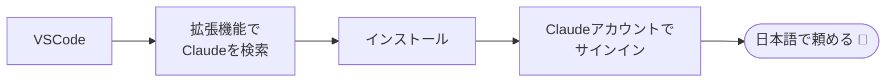

# Claudeを入れる

!!! info "この章のゴール"
    VSCodeの中で **Claude（クロード）** に日本語で話しかけられる状態になること。
    ここまで来ると、次の Git / GitHub の準備を **Claudeに頼んで** 進められます。

<figure markdown="span">
  { width="320" }
  <figcaption>「○○して」とお願いすると、操作を手伝ってくれます</figcaption>
</figure>

Claudeは、**VSCodeの中で日本語でお願いできるAIの相棒**です。
「議事録のテンプレートを作って」「この文章を分かりやすく直して」のように頼むと、
ファイルを作ったり書き換えたりする作業を、代わりに進めてくれます。



---

## 1. VSCode拡張として入れる（おすすめ）

1. VSCodeの左側の **拡張機能（四角が4つのアイコン :material-puzzle-outline:）** を開く
2. 検索欄に **`Claude`** と入力する
3. :material-alert-octagon: **発行元（Publisher）が `Anthropic` かどうかを必ず確認する**（下の :material-shield-check: を参照）
4. 確認できたら **インストール（Install）** を押す
5. 画面の案内に従って、Claudeのアカウントでサインインする

!!! danger ":material-shield-check: 発行元の確認は必ず（ここだけは飛ばさない）"
    拡張機能ストアには、**本物に似せた名前のニセ拡張** が混ざることがあります。
    ニセ拡張を入れると、PC内のファイルや入力内容を盗まれるおそれがあります。

    入れる前に、拡張の名前をクリックして詳細ページを開き、**次の3点** を確認してください。

    | 確認すること | 正しい状態 |
    |---|---|
    | **発行元（Publisher）** | **`Anthropic`**（`anthropic.claude-code` のような表記） |
    | **認証済みバッジ** | 発行元名のよこに :material-check-decagram: （Verified）が付いている |
    | **インストール数** | 数十万〜数百万規模。**極端に少ないものは疑う** |

    ひとつでも合わなければ **入れずに閉じてください**。似た名前・似たアイコンでも別物です。

    ```mermaid
    flowchart LR
        A[Claude で検索] --> B{発行元は<br/>Anthropic？}
        B -- はい --> C[インストール ✅]
        B -- いいえ --> D[入れない 🚫<br/>社内の担当に相談]
    ```

!!! quote "📷 画面キャプチャ枠（あとで差し込み）"
    拡張機能で「Claude」を検索し、**発行元 Anthropic が見える** 状態の画面を入れます。
    `{ width="700" }`

!!! tip "Node.js などの事前準備は不要です"
    Claude Code の VSCode拡張には、必要なもの（CLI）が **内蔵** されています。
    そのため **Node.js のインストールは不要** です。拡張を入れてサインインすれば、すぐ使えます。
    （`npm install` でCLIを入れる方法だけは Node.js が必要ですが、拡張を使うなら関係ありません。）

!!! info "正確な手順は公式案内を確認"
    Claudeの導入方法は更新されることがあります。最新の手順は、社内の案内または公式ドキュメントを確認してください。
    （会社で配布・利用ルールがある場合は、それに従ってください。）

---

## 2. 使ってみる（お願いの仕方）

入力欄に、**日本語でそのまま** 書けばOKです。命令口調でなくてもかまいません。

```text
このフォルダの中身を教えて。
```

```text
meeting-memo.md を作って、打ち合わせメモのテンプレートを書いて。
```

!!! tip "上手に頼むコツ"
    - **何を・どうしたいか** を1〜2文で書く（例：「この文章を、社外向けのていねいな言い方に直して」）
    - 分からないときは **「これ何？」と聞く**。用語の説明もしてくれます
    - もっと詳しいコツは → [付録：Claudeの頼み方とMarkdown](appendix.md)

!!! warning "貼り付けてはいけない情報"
    パスワード・APIキー・お客様の個人情報などは、**入力欄に貼らない** でください。
    詳しくは → [AIと安全に付き合う](ai-safety.md)

---

## 3. ターミナルでも使う：CLI版（任意）

VSCodeの拡張だけで十分な人は、ここは **飛ばしてOK** です。
ターミナルから `claude` を直接使いたい人向けに、CLI版も入れられます（**Node.js は不要**）。

### 入れると何がうれしい？

| メリット | どんなとき便利か |
|---|---|
| **VSCodeを開かなくても使える** | 「ちょっと1つ聞きたい／直したいだけ」のときに、すぐ起動できる |
| **同時に何本も動かせる** | ターミナルを2つ開けば、別々のフォルダの作業を **並行** で進められる |
| **手元のPC以外でも使える** | 社内サーバーなどに接続した先（SSH）でも、同じように頼める |
| **決まった作業を自動化できる** | 「毎朝このチェックをする」のような繰り返し作業を、あとから自動実行にできる |
| **拡張の調子が悪いときの逃げ道** | VSCodeが重い・拡張が動かないときも、CLIなら作業を続けられる |

!!! note "急がなくて大丈夫"
    最初は拡張版だけで十分です。「毎回VSCodeを開くのが面倒だな」と感じたら、そのときに入れれば十分間に合います。
    どちらを使っても、**頼み方（日本語で書く）は同じ** です。

=== ":material-apple: Mac / Linux"

    ```bash
    curl -fsSL https://claude.ai/install.sh | bash
    ```

=== ":material-microsoft-windows: Windows（PowerShell）"

    ```powershell
    irm https://claude.ai/install.ps1 | iex
    ```

入れたら、ターミナルで `claude` と打って起動し、初回は画面の案内に従ってログインします。

!!! note "Node.js で入れる方法もある"
    すでに Node.js（18以上）がある人は `npm install -g @anthropic-ai/claude-code` でも入れられます。どれか1つの方法でOKです。

---

## この章のまとめ

- [x] Claude拡張を入れた
- [x] サインインして、日本語で話しかけられた

!!! success "次のステップ"
    相棒がそろいました。最後に、変更の履歴を扱う **Git** と、ネット上の置き場 **GitHub** をつなぎます。
    ここからは、迷ったら **Claudeに頼めば** 進められます。

    👉 [GitとGitHubをつなぐ](setup-git.md)
