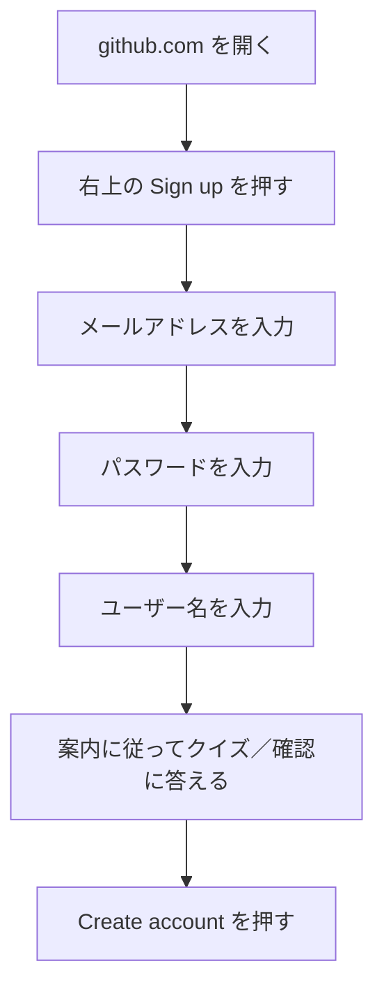
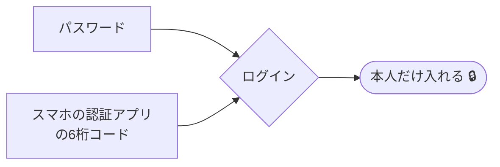

# GitとGitHubをつなぐ

!!! info "この章のゴール"
    **GitHubアカウント** を作り、PCに **Git** を入れて、
    VSCodeから「自分のGitHub」とやりとりできる状態になること。
    あわせて、安全に使うための初期設定（2段階認証）まで済ませます。

<figure markdown="span">
  { width="320" }
  <figcaption>手元のPCと、ネット上の置き場をつなぎます</figcaption>
</figure>

## 全体の流れ

所要時間はだいたい **15〜20分** です。


!!! tip "むずかしいところは Claude に頼める"
    前のページで **Claude** を入れたので、4以降の作業は
    「Gitを入れて」「GitHubにログインできるようにして」と頼めば代わりに進めてくれます。

!!! warning "はじめに：会社のルールを確認"
    会社で使う場合は、**会社のメールアドレス**で登録するか、社内ルールに従ってください。
    すでに「このメールアドレスで作って」と案内されている場合は、それに従いましょう。

---

## 1. GitHubアカウントを作る

ブラウザ（Chrome や Edge）で [https://github.com](https://github.com) を開きます。



操作の対応表です。英語のボタンが多いので、迷ったらここを見てください。

| 画面の表示（英語） | 意味・やること |
|---|---|
| **Sign up** | 新規登録（アカウントを作る） |
| **Enter your email** | メールアドレスを入力 |
| **Create a password** | パスワードを作る |
| **Enter a username** | ユーザー名（半角英数字）を決める |
| **Continue / Create account** | 次へ進む／登録を確定する |

<figure markdown="span">
  { width="700" }
  <figcaption>右上の <strong>Sign up</strong>（赤枠）が新規登録の入口です。隣の Sign in は「すでにアカウントがある人」用</figcaption>
</figure>

!!! danger "個人情報の取り扱いに注意"
    - 登録に使うメールアドレスやパスワードは、**この資料や社内チャットに貼り付けないでください**。
    - パスワードは他サービスと**使い回さない**でください。

??? tip "ユーザー名の決め方（クリックで開く）"
    - 半角の英数字とハイフンが使えます（例：`taro-example`）。
    - 後から変更もできますが、URLが変わるため**最初に決めておく**のがおすすめです。
    - 実名でなくてもかまいませんが、社内で使うなら**誰か分かる名前**にしておくと便利です。

### メール認証をする

登録したメールアドレスに、GitHubから確認コード（数字）が届きます。


!!! note "コードが届かないときは"
    - **迷惑メールフォルダ**を確認してください。
    - 数分待っても届かなければ、画面の **Resend（再送）** を押します。
    - メールアドレスの打ち間違いがないか、もう一度確認しましょう。

!!! quote "📷 画面キャプチャ枠（あとで差し込み）"
    確認コードの入力画面を入れる場所です。
    `{ width="700" }`

---

## 2. プロフィールの初期設定

ログインできたら、最低限のプロフィールを整えます。**あとからでも変更できる**ので、まずは軽くでOKです。

- **表示名（Name）**：社内で誰か分かる名前にしておくと、共同作業のときに便利です。
- **アイコン（Profile picture）**：顔写真でなくてもOK。設定すると見分けがつきやすくなります。

設定場所への行き方：


!!! quote "📷 画面キャプチャ枠（あとで差し込み）"
    Settings（設定）の場所がわかる画面を入れます。
    `{ width="700" }`

---

## 3. 安全のための設定（2段階認証） { #two-factor }

!!! warning "ここは必ず設定しましょう"
    GitHubは大切なファイルを置く場所です。**2段階認証（2FA）** を設定すると、
    万一パスワードが漏れても、本人以外はログインできなくなります。

2段階認証は、ログイン時に「パスワード」＋「スマホアプリの数字」の**2つ**を使う仕組みです。



設定の入り口：**Settings → Password and authentication → Two-factor authentication** から進めます。
画面の案内に従って、スマホの認証アプリ（例：Google Authenticator など）と連携します。

!!! danger "リカバリーコードは必ず保管"
    2段階認証を設定すると、**リカバリーコード**（緊急用の合言葉）が表示されます。
    スマホを失くしたときの命綱なので、**安全な場所に保管**してください。社内チャット等には貼らないこと。

---

## 4. Git（ギット）を入れる

Gitは、**変更の履歴を管理する“仕組み”そのもの**です（→ [用語集](glossary.md)）。GitHubを使うPCに必要です。

=== ":material-robot-happy-outline: Claudeに頼む"

    VSCodeのClaudeに、こう頼むだけでOKです。

    ```text
    このPCにGitが入っているか確認して、入っていなければ入れて。
    ```

    お使いのPCに合った方法で、確認から導入まで進めてくれます。

=== ":material-microsoft-windows: Windows（自分で）"

    1. [https://git-scm.com/download/win](https://git-scm.com/download/win) を開く
    2. 自動でダウンロードが始まる（始まらなければ案内のリンクを押す）
    3. ファイルを開き、画面の案内は **基本そのまま「Next」** で進めてOK
    4. 「Install」→「Finish」で完了

=== ":material-apple: Mac（自分で）"

    Macは最初からGitが入っていることが多いです。まず確認します。

    1. **VSCodeを開く** → メニューの「ターミナル」→「新しいターミナル」
    2. 次の1行を貼り付けて Enter

        ```bash
        git --version
        ```

    3. `git version 2.xx.x` のように出れば、すでに入っています
    4. 入っていない場合は、案内ウィンドウが出るので **「インストール」** を押す

!!! note "確認だけなら覚えなくてOK"
    `git --version` は「入っているか確かめる」ためのものです。意味を覚える必要はありません。

---

## 5. VSCodeからGitHubにサインインする

VSCodeと、この章で作った **GitHubアカウント** をつなぎます。これで「自分のGitHub」とやりとりできます。


!!! quote "📷 画面キャプチャ枠（あとで差し込み）"
    VSCode左下のアカウントアイコンからサインインする画面を入れます。
    `{ width="700" }`

---

## 6. GitHub CLI（gh）を入れる（GitHub操作におすすめ） { #github-cli-gh }

GitHub CLI（`gh`）は、GitHubの操作（**リポジトリ作成・プルリク作成** など）を行うための道具です。

!!! info "実は「Claudeに頼む」ときも使われます"
    Claudeにリポジトリ作成やプルリク作成を頼むと、Claudeは **内部でこの `gh` コマンドを使います**。
    そのため、Claudeで進める人も `gh` を入れておくとスムーズです（未導入だと、これらの操作でつまずくことがあります）。

    - **コミット・プッシュ** だけなら `git`（前の手順で導入済み）でOK ― `gh` は不要です
    - **リポジトリ作成・プルリク作成** など“GitHub側”の操作で `gh` が活躍します
    - **GitHubサイト（ブラウザ）だけ** で操作するなら、`gh` がなくても大丈夫です

### いちばん簡単：Claudeに頼む

VSCodeのClaudeに、こう頼むだけでOKです。

```text
GitHub CLI（gh）を入れて、GitHubにログインできるようにして。
```

Claudeが、お使いのPCに合った方法でインストールから初期設定（ログイン）まで進めてくれます。
（Homebrewなどの準備が必要な場合も、まとめてやってくれます。）

### 自分で入れる場合

=== ":material-microsoft-windows: Windows"

    PowerShell などで次を実行します。

    ```powershell
    winget install --id GitHub.cli
    ```

    うまくいかないときは [cli.github.com](https://cli.github.com) のインストーラーからでも入れられます。

=== ":material-apple: Mac"

    [Homebrew](https://brew.sh) が入っていれば、次の1行で入ります。

    ```bash
    brew install gh
    ```

    !!! note "Homebrew が入っていないとき"
        Homebrew は、Macでソフトを入れるための定番ツールです。
        未導入なら [brew.sh](https://brew.sh) の手順で入れるか、**Claudeに「Homebrewを入れて」と頼む** のが簡単です。
        （`gh` の導入ごとClaudeに頼めば、必要な準備もまとめてやってくれます。）

入れたら、GitHubと接続（ログイン）します。

```bash
gh auth login
```

画面の質問に **↑↓ と Enter** で答えていきます（迷ったら `GitHub.com` → `HTTPS` → ブラウザで認証、の順で選べばOK）。

!!! tip "入っているか確認"
    `gh --version` でバージョンが表示されれば準備完了です。
    入れ方に迷ったら、Claudeに「`gh` を使えるようにして」と頼むこともできます。

---

## この章のまとめ


- [x] GitHubにログインできる
- [x] プロフィールを設定した
- [x] 2段階認証で安全にした
- [x] PCにGitを入れた
- [x] VSCodeからGitHubにサインインした
- [x] GitHub CLI（`gh`）を入れた

!!! success "次のステップ"
    道具がすべてそろいました。さっそく、Claudeに頼みながら **自分のファイル置き場（リポジトリ）** を作ってみましょう。

    👉 [最初の一歩（リポジトリを作る）](first-steps.md)
