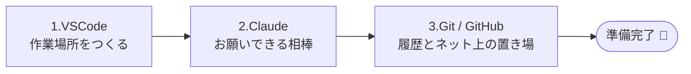
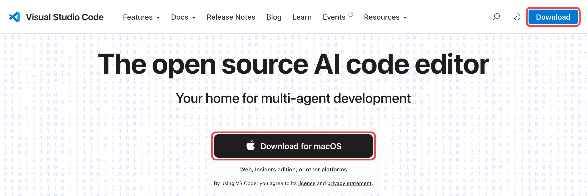

# VSCodeを入れる

!!! info "この章のゴール"
    自分のPCに **VSCode（ブイエスコード）** を入れて、
    「ファイルを開いて編集できる」状態になること。

<figure markdown="span">
  { width="320" }
  <figcaption>必要な道具を、順番にそろえていきます</figcaption>
</figure>

## 「準備する」章の進み方

準備は、次の **3ステップ** です。1ページずつ進めれば大丈夫です。

!!! tip "なぜこの順番なのか"
    先に **VSCode → Claude** をそろえておくと、そのあとの Git や GitHub の準備を
    **Claudeに日本語で頼んで進められる** ようになります。むずかしい作業を後ろに回す作戦です。

このあとの章では、GitHubの操作を次の **2通り** で並べて説明します。好きな方を選んでください。

- :material-robot-happy-outline: **Claudeに頼む** … VSCodeの中で、Claudeに日本語でお願いする（コマンド不要）
- :material-cursor-default-click-outline: **自分で操作** … 画面のボタンを自分でクリックする

---

## 1. VSCodeとは

VSCodeは、**文章やファイルを編集できる無料のソフト**です。
このガイドでは「**作業する場所**」として使います。GitHubとの相性がよく、初心者にもおすすめです。

| VSCodeでできること | イメージ |
|---|---|
| ファイルを開く・書き換える | Wordのような編集画面 |
| フォルダをまるごと開く | 左側にファイル一覧が並ぶ |
| 変更の履歴を扱う | あとで入れる **Git** と連携する |
| AIに頼む | あとで入れる **Claude** が中で動く |

---

## 2. インストールする

公式サイト [https://code.visualstudio.com](https://code.visualstudio.com) を開き、自分のPCに合うボタンから入れます。

=== ":material-microsoft-windows: Windows"

    1. 公式サイトの **Download for Windows** を押す
    2. ダウンロードされたファイル（`...User Setup.exe`）を開く
    3. 画面の案内に従って「次へ」で進める（途中の同意・追加タスクはそのままでOK）
    4. 完了したらVSCodeを起動する

=== ":material-apple: Mac"

    1. 公式サイトの **Download for macOS** を押す
    2. ダウンロードされた `.zip` を開くと、`Visual Studio Code` アプリが出てくる
    3. それを **アプリケーション** フォルダにドラッグして移動する
    4. アプリケーションから起動する

<figure markdown="span">
  { width="700" }
  <figcaption>赤枠のどちらのボタンからでもダウンロードできます</figcaption>
</figure>

!!! note "ボタンの文字はお使いのPCで変わります"
    公式サイトは、開いたPCを自動で判別します。上の画像は **Mac** で開いたときのもので、
    Windowsで開くと **Download for Windows** と表示されます。表示された **そのままのボタン** を押せばOKです。

!!! tip "日本語表示にする"
    初回起動時に「日本語に変更しますか？」と出たら **「インストールして再起動」** を押すと、メニューが日本語になります。
    出なかった場合は、左側の **拡張機能 :material-puzzle-outline:** で `Japanese Language Pack` を検索して入れれば同じです。

---

## 3. 画面の見方（ざっくり）

最初はこの3か所だけ覚えれば十分です。

- **左のアイコン列** … :material-file-multiple-outline: ファイル一覧、:material-puzzle-outline: 拡張機能（Claudeもここから入れます）
- **中央** … 実際に文章やコードを書くところ
- **ターミナル** … メニューの「ターミナル」→「新しいターミナル」で開く。コマンドを打つ場所です

!!! note "ターミナルは怖くない"
    ターミナルは「文字で指示を出す窓口」です。このガイドでは、貼り付けるだけの1行しか使いません。
    しかも多くの場面は **Claudeに頼めば代わりに実行してくれます**。

---

## この章のまとめ

- [x] VSCodeを入れた
- [x] 起動して、画面のどこに何があるか分かった

!!! success "次のステップ"
    作業場所ができました。次は、その中で日本語でお願いできる相棒 **Claude** を入れましょう。

    👉 [Claudeを入れる](setup-claude.md)
